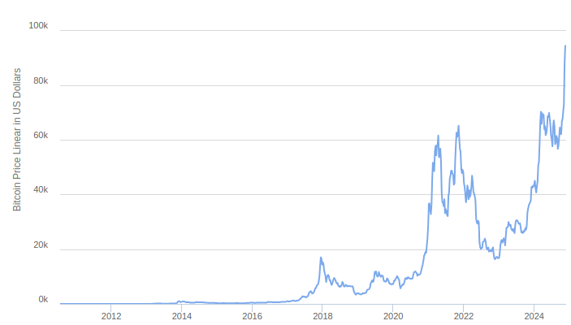
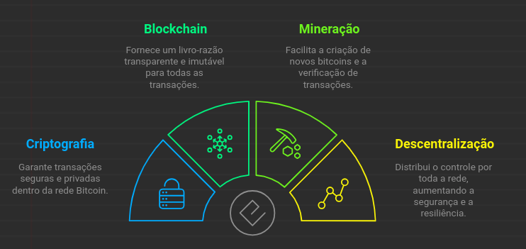
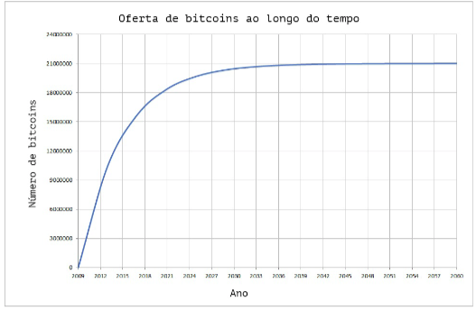
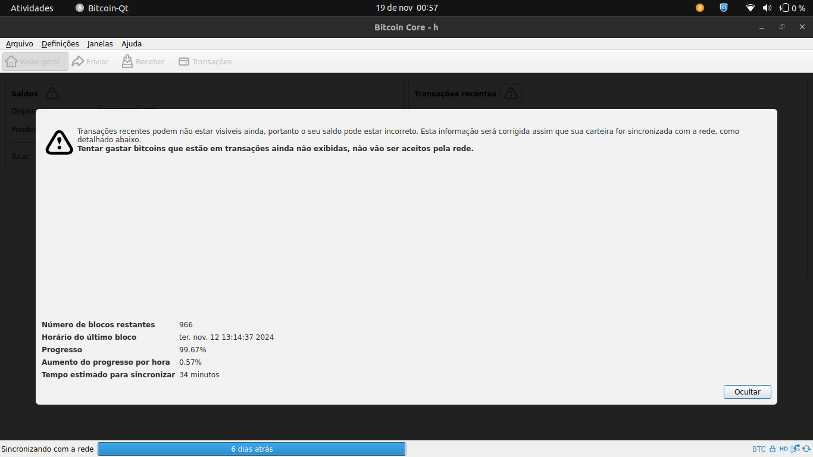
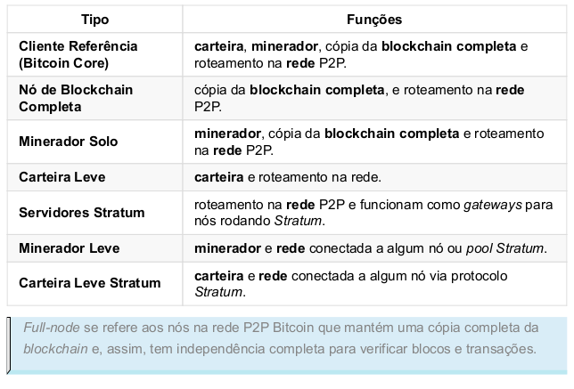
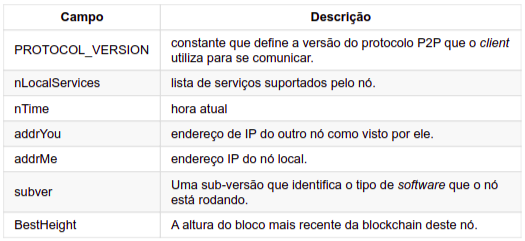
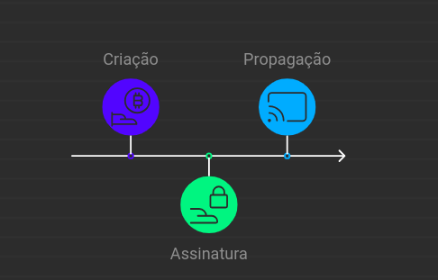

# cyber

# **Bitcoin**
### Por Paulo Henrique  
**Trabalho na equipe de operações, no projeto JESSIE.**

---

## **Objetivo**
- Apresentar o **Bitcoin**, uma moeda digital descentralizada.
- Explicar seus fundamentos, funcionamento e possíveis aplicações no **Maino**.

---

## **Breve História do Bitcoin**
- Criado em **2008** por **Satoshi Nakamoto** (pseudônimo).
- [Bitcoin: A Peer-to-Peer Electronic Cash System](https://bitcoin.org/bitcoin.pdf)
- Objetivo: criar uma moeda **digital descentralizada** e independente de bancos ou governos.  

---

## **Importância Atual**

  ### 
- Hoje, **1 Bitcoin vale quase 100 mil dólares**.  
- Países e empresas reconhecendo e adotando Bitcoin:  
  - **El Salvador**: primeira nação a adotá-lo como moeda oficial.  
  - **BlackRock**: maior gestora de ativos investindo em Bitcoin.  
  - **PayPal**: aceita Bitcoin como forma de pagamento.  
- **Blockchain** está sendo usada em:  
  - Logística, saúde e criação de novas moedas digitais.

---

## **Como Funciona o Bitcoin**
- É uma rede que utiliza as tecnologias:
  - 

---

## **Criptografia**
- Garante a segurança das transações.  
  - **Carteira Bitcoin**: armazena chaves públicas e privadas.  
    - **Chave pública**: usada para receber bitcoins.  
    - **Chave privada**: usada para assinar transações.  

  ```ruby
  comexnfe/lib/iugu/rsa.rb
  ```
(requisicao para criação de subconta na iugu requer assinatura com chave privada)   

---

## **Blockchain**
- **A blockchain** é um registro público de todas as transações feitas com Bitcoin.
   - 🔗 **Cada bloco da blockchain** contém:
      - Um conjunto de transações.
      - Um hash do bloco anterior, formando uma cadeia de blocos.
   - 🔑 **Processo para adicionar um novo bloco**:
      - Mineradores resolvem problemas matemáticos complexos (**Proof of Work**), que consomem muita energia e tempo.
   - 🎉 **Recompensa**:
      - Ao adicionar um bloco, transações são validadas, e mineradores recebem bitcoins.
   - 📜 **Características principais**:
      - **Imutável**: Uma vez registrada, uma transação não pode ser alterada ou apagada.
      - **Transparente**: Qualquer pessoa pode visualizar todas as transações feitas com Bitcoin.

   - [Como funciona a blockchain?](https://www.youtube.com/watch?v=SSo_EIwHSd4)

---

## **Mineração**
- **Mineração** é o processo de validar transações e adicionar novos blocos à blockchain.
   - 🖥️ **Como funciona?**
      - Mineradores usam computadores poderosos para resolver problemas matemáticos.
   - ⚡ **Características**:
      - Consome muita energia.
      - É competitivo: mineradores competem para adicionar blocos e receber recompensas.
      - É descentralizado: não controlado por uma entidade central.
   - 📉 **Recompensa**:
      - Reduzida pela metade a cada 4 anos, limitando a criação de bitcoins.
      - 
   - 🤝 **Pool de mineração**:
      - Grupo de mineradores que se unem para aumentar chances de sucesso.

- [O que é mineração de Bitcoin?](https://www.youtube.com/watch?v=GmOzih6I1zs)

---

## **Descentralização**
- **Descentralização** significa que não há controle centralizado da rede (**P2P**), garantindo segurança e transparência.
   - 📂 **Cada nó da rede**:
      - Possui uma cópia da blockchain.
      - Valida as transações.
   - ❌ **Fraude**:
      - Nós desonestos são rejeitados pelos demais, invalidando transações.

---

## **Como Rodar um Nó Bitcoin**
### **O que é um nó Bitcoin?**
- Um computador que:
   - Valida transações feitas com Bitcoin.
   - Contribui para a segurança e descentralização da rede.
- **Software necessário**: Bitcoin Core.

### **Passos para configurar**:
1. Baixe o Bitcoin Core e sincronize com a rede (pode levar dias).
   - 
2. **Tipos de nós**:
   - Carteira.
   - Minerador.
   - Blockchain completa.
   - Roteamento na rede P2P.
   - 
3. Após sincronizar, seu nó estará pronto para validar transações.

---

## **Instalação do Bitcoin Core**
### **Passos:**
1. Baixe o Bitcoin Core: [Link para download](https://bitcoin.org/en/download).
2. Extraia o arquivo:
   ```bash
   tar -xvf bitcoin-27.0-x86_64-linux-gnu.tar.gz
   ```
3. Acesse a pasta:
   ```bash
   cd bitcoin-27.0/bin
   ```
4. Inicie o Bitcoin Core:
   - GUI:
     ```bash
     ./bitcoin-qt
     ```
   - CLI:
     ```bash
     ./bitcoind
     ```
5. Aguarde a sincronização com a rede.
6. **Pronto**: Você agora tem um nó Bitcoin rodando!

---

## **O que acontece ao iniciar o Bitcoin Core?**
### **Etapas principais**:
1. 🌐 **Descoberta de peers**:
   - DNS seeds: Lista de IPs no código-fonte (arquivo `chainparams.cpp`, linha 112).
     - Comando: 
       ```bash
       nslookup seed.bitcoin.sipa.be
       ```
   - Peers conhecidos: Armazenados no arquivo `peers.dat`.
   - Conexões de saída: Nó recebe uma lista de outros nós.
2. 🤝 **Handshake**:
   - Envio da mensagem de versão.
   - Resposta com "verack" para confirmar conexão.
   - 
3. 🔄 **Troca de inventário**:
   - Solicitação e envio de cabeçalhos e blocos.
4. ✅ **Sincronização da blockchain**.
5. 📣 **Propagação de transações**.

---

## **Transações Bitcoin**
- **O que é uma transação Bitcoin?**
   - Transferência de bitcoins de uma carteira para outra.
   - 🧩 **Componentes**:
      - **Inputs**: Entradas (bitcoins transferidas).
      - **Outputs**: Saídas (carteiras de destino).
      - **Fee**: Taxa paga para validação.
   - **Assinatura**:
      - Garantida com a chave privada do remetente.
   - **Rede**:
      - Transação é propagada e validada por nós.

### **Ciclo de vida**:
- 

---

1. **Obter UTXOs disponíveis**  
   Antes de criar a transação, você precisa identificar os UTXOs disponíveis na sua carteira. Use o comando:  

   ```bash
   bitcoin-cli listunspent
   ```

   - Esse comando retorna uma lista de UTXOs. Cada UTXO contém:
     - `txid`: O ID da transação.
     - `vout`: O índice da saída na transação.
     - `amount`: O valor em BTC.
   - Exemplo de saída:
     ```json
     [
       {
         "txid": "txid12345abc",
         "vout": 0,
         "address": "1MinhaCarteira123",
         "amount": 0.1
       }
     ]
     ```

2. **Criar a transação bruta**  
   Use o comando `createrawtransaction` para criar a transação. Por exemplo:

   ```bash
   bitcoin-cli createrawtransaction '[{"txid":"txid12345abc","vout":0}]' '{"1EnderecoDestino123":0.01,"1EnderecoTroco123":0.089}'
   ```

   - Aqui:
     - **Entrada**:  
       - `txid`: `"txid12345abc"`.
       - `vout`: `0`.
     - **Saídas**:  
       - `"1EnderecoDestino123"`: 0.01 BTC para o destinatário.
       - `"1EnderecoTroco123"`: 0.089 BTC de troco.  

   - O valor restante (0.001 BTC neste caso) será considerado como a **taxa da transação**.

   O comando retornará uma transação bruta (um hash hexadecimal) semelhante a este:
   ```text
   0200000001abcdef...000000
   ```

3. **Assinar a transação**  
   Assine a transação bruta com o comando `signrawtransactionwithwallet` (se a chave privada estiver na sua carteira) ou `signrawtransactionwithkey` (caso precise informar a chave privada manualmente).  

   Exemplo com a carteira:
   ```bash
   bitcoin-cli signrawtransactionwithwallet "0200000001abcdef...000000"
   ```

   Exemplo com chave privada:
   ```bash
   bitcoin-cli signrawtransactionwithkey "0200000001abcdef...000000" '["KzMinhaChavePrivada123"]'
   ```

   - Esse comando retornará a transação assinada, no campo `hex`.

4. **Enviar a transação para a rede**  
   Use o comando `sendrawtransaction` para enviar a transação assinada:  

   ```bash
   bitcoin-cli sendrawtransaction "<transacao_assinada>"
   ```

   Exemplo:
   ```bash
   bitcoin-cli sendrawtransaction "0200000001abcdef...000000"
   ```

   - O comando retorna o **txid** da transação enviada, que pode ser usado para rastrear o status na blockchain.

---

### **Dicas úteis**
- **Estime a taxa**: Use o comando `estimatesmartfee` para calcular uma taxa ideal com base na prioridade:
   ```bash
   bitcoin-cli estimatesmartfee 6
   ```

## **Aplicações no ERP**
- **Integração com Bitcoin** no ERP:
   - Permitir clientes usem Bitcoin como forma de pagamento através do endereço da carteira e QR code.
   -
   
--- 


## **Referências**
- [Bitcoin.org](https://bitcoin.org/en/)
- [O que é mineração de Bitcoin?](https://www.youtube.com/watch?v=GmOzih6I1zs)
- [Como funciona a blockchain?](https://www.youtube.com/watch?v=SSo_EIwHSd4)
- [Guia para desenvolvedores Bitcoin](https://developer.bitcoin.org/devguide/index.html)
- [Bitcoin para progamadores(LIVRO)](https://itsrio.org/wp-content/uploads/2018/06/bitcoin-para-programadores.pdf)
